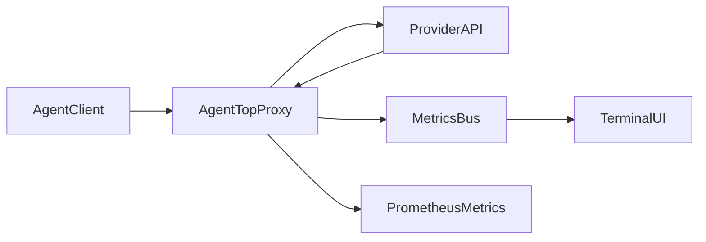

# AgentTop

**The htop for AI Agents.**

AgentTop is a terminal-native observability layer for LLM apps and coding agents: run one local proxy, then watch live token throughput, latency, and spend in a dense cyberpunk dashboard.

## Why AgentTop

- **Zero SaaS setup**: runs locally as a single Node.js process.
- **Provider-aware proxy**: routes OpenAI and Anthropic-compatible requests.
- **Live telemetry**: tokens/sec, latency, request stream, top models, and session cost.
- **Cost visibility**: estimates USD per request from model pricing rules.
- **Ops-ready**: exposes Prometheus metrics at `/metrics`.

## What You See In The Dashboard

- `Token Throughput (Tokens/s)` line chart
- `Cost by Model (USD)` bar chart
- `Latency (ms)` sparkline
- `Intercepted Requests` rolling log feed
- `Top Models` table
- `Total Session Cost ($)` LCD panel
- Bottom HUD with request count, average latency, and dominant model

## Quickstart

### Prerequisites

- Node.js `>= 20`

### Install and run

```bash
npm install
npm run build
npm start
```

### Development mode

```bash
npm run dev
```

### CLI usage

```bash
agenttop start
agenttop start --port 8081
```

You can also run directly from the built output:

```bash
node dist/index.js start --port 8081
```

## Connect Your Agent Tooling

Point your AI tool's base URL to:

```bash
http://localhost:8080/v1
```

Example (shell):

```bash
export BASE_URL="http://localhost:8080/v1"
```

## Prometheus Metrics

AgentTop exposes scrape-friendly metrics on the same server:

```bash
curl -s http://localhost:8080/metrics
```

Metric families include:

- `agenttop_requests_total`
- `agenttop_tokens_total{type="prompt|completion|all"}`
- `agenttop_cost_usd_total`
- `agenttop_request_latency_ms_sum`
- `agenttop_request_latency_ms_count`
- `agenttop_model_cost_usd_total{model="..."}`

## How It Works



1. `agenttop start` boots both the proxy and terminal UI.
2. Proxy intercepts provider responses, extracts usage/model, and computes estimated cost.
3. Metric events stream into the dashboard for real-time rendering.
4. Aggregate counters are exported for Prometheus scraping.

## Repository Map (Human + Agent Friendly)

- `src/index.ts`: CLI entrypoint, startup/shutdown lifecycle.
- `src/proxy.ts`: provider routing, response interception, usage parsing, `/metrics`.
- `src/events.ts`: typed local event bus between proxy and UI.
- `src/ui.ts`: blessed-contrib layout and real-time widget updates.
- `src/pricing.ts`: model pricing table and cost calculation.

## Extension Guide For Coding Agents

- **Add model pricing**: update `MODEL_PRICING` in `src/pricing.ts`.
- **Adjust provider detection/routing**: edit `detectProvider` and proxy routing in `src/proxy.ts`.
- **Improve usage extraction**: extend `parseUsage` / SSE parsing paths in `src/proxy.ts`.
- **Add new dashboard panels**: expand grid/widgets in `src/ui.ts` and update `onMetric`.
- **Export more metrics**: add counters and exposition lines in `src/proxy.ts`.

## Caveats

- Cost numbers are estimates based on local pricing rules, not provider billing truth.
- Unknown or unmatched model names currently resolve to `$0` estimated cost.
- Streaming usage parsing is best-effort and depends on provider event payload shape.
- Repository metadata currently has license-field inconsistency between `package.json` and `LICENSE`; verify before publishing downstream package metadata.
